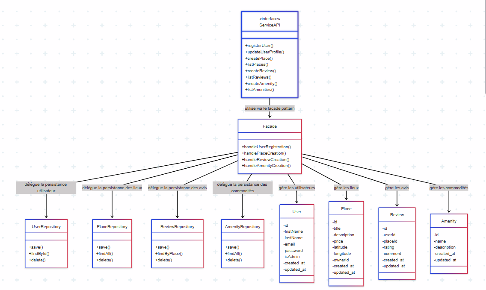
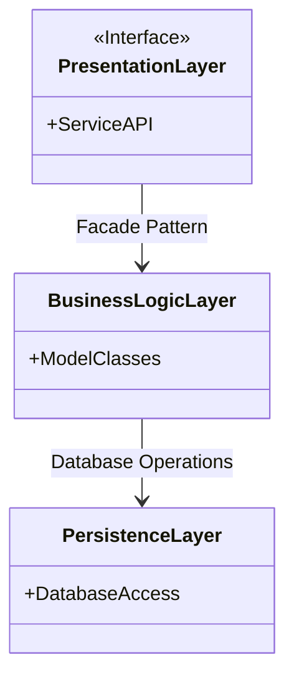

# Hbnb Project Holberton School

## Summary

1. [Introduction](#Introduction).
2. [High-Level Architecture](#High-Level-Architecture)
3. [Business Logic Layer](#Business-Logic-Layer)
4. [API Interaction Flow](#API-Interaction-Flow)
    - [User Registration Diagram](#User-Registration-Diagram)
    - [Place Creation Diagram](#Place-Creation-Diagram)
    - [Review Submission Diagram](#Review-Submission-Diagram)
    - [Fetching a List of Places Diagram](#Fetching-a-List-of-Places-Diagram)

## Introduction

The Hbnb project is a groupe project where we need to createa copy of the Airbnb site to learn the basic of web programmation

## High-Level Architecture

## 0. High-Level Package Diagram

### Objective

Create a high-level package diagram illustrating the three-layer architecture of the HBNB application as well as the communication between these layers via the facade pattern. This diagram provides a conceptual overview of how the application’s components are organized and interact with each other.

### Diagram

---

### Description

This task consists of creating a diagram that represents the structure of the application by focusing on its three main layers:

- **Presentation Layer (Services, API)**: This layer manages the interaction between the user and the application. It includes all the services and API endpoints accessible to users.

- **Business Logic Layer (Models)**: This layer contains the core business logic and the models representing the system’s entities (User, Place, Review, Amenity).

- **Persistence Layer**: This layer is responsible for data storage and retrieval, interacting directly with the database.

The diagram should clearly show these three layers, the components within each layer, and the communication pathways between them. The facade pattern should be represented as the unified interface through which the layers communicate.

---

### Key Steps

1. **Understand the layered architecture**  
   Understand the role and responsibility of each layer in the context of the HBNB application.

2. **Research the facade pattern**  
   Study how this pattern simplifies interactions between layers by providing a single interface.

3. **Identify key components**  
   - Presentation Layer: Services, API  
   - Business Logic Layer: Business models (User, Place, Review, Amenity)  
   - Persistence Layer: Data access objects or repositories

4. **Create the diagram**  
   Design a clear and logical diagram illustrating the layers, their components, and communication via the facade.

5. **Review and refine**  
   Ensure the diagram is complete and easy to understand, then make adjustments if necessary.

---

### Simplified example (Mermaid.js)

## Explanatory Notes

- **Clear Layer Responsibilities:** Each layer in the architecture has a distinct and well-defined responsibility, which helps keep the codebase organized, modular, and easier to maintain.

- **Facade Pattern Simplification:** The facade pattern centralizes the communication between layers by providing a simple, unified interface to the upper layers while hiding the internal complexities of the lower layers.

- **Facilitates Evolution:** This architectural approach makes managing dependencies simpler and supports easier future enhancements or modifications to the application.

---

## Recommended Learning Resources

- [Layered Software Architecture](https://en.wikipedia.org/wiki/Multitier_architecture)  
- [Facade Pattern Overview](https://refactoring.guru/design-patterns/facade)  
- [UML Package Diagram Guide](https://www.uml-diagrams.org/package-diagrams.html)

## Business Logic Layer

## API Interaction Flow

Purpose : Sequence Diagram represente how the site will communicate with the API, the Database and the front (User)  
key compennent :  
- User : the "User" participant represent a User that will interact with the front of the site  
- API : The "API" participant represent the Backend of the site that will receive the information from the front  
- BusinessLogic : the "Business Logic" participant represent all the controle that we will do to the Data receive by the API  
- Database : the "Databasec" participant represent the Database of the site that will stock all information of place and User  

### User Registration Diagram  

1 step : User connect to the site and sign up a new account  
2 step : Test if all information given by the User is right (mail existing, age possible,...)  
3 step : Saved all the data given by the User in the database  
4 step : Confirme that the database save all the wanted data  
5 step : The API get the error message or the confirmation message  
6 step : The user can see the message (Sucess or Fail to create is account)   

### Place Creation Diagram  

### Review Submission Diagram  

### Fetching a List of Places Diagram  

